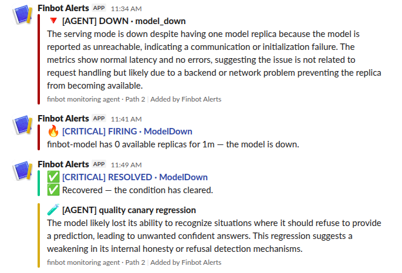

# finbot — a finance-education LLM platform (MLOps, end to end)

A finance-education assistant built the production way: curate data → fine-tune (QLoRA) → gate →
serve on CPU → resilient gateway → deterministic monitoring → **an LLM explanation layer**. This
repo covers **Days 1–7**.

```
Day 1  DATA     ingest → curate (quality + PII) → build → validate → split
Day 2  TRAIN    QLoRA fine-tune → merge → push (model + GGUF) to the Hub
Day 3  GATE     score the GGUF vs a golden set → pass/fail → register a version
Day 4  SERVE    run the GGUF in-cluster on CPU (llama-cpp-svc)
Day 5  GATEWAY  resilient FastAPI gateway + Redis (fastapi-gateway-svc)
Day 6  MONITOR  Prometheus + Alertmanager → Slack   (Path 1 · reliable · no LLM)
Day 7  AGENT    LangGraph agent → LLM → Slack        (Path 2 · explanation)          ← this repo
Day 8  DEPLOY   3-node Kubernetes/GitOps (Node A/B/C)
```

---

## Day 7 — the monitoring agent (this repo's focus)

A **LangGraph agent** (Node C) sits on top of Day 6 as an **explanation layer** — a second,
**independent** Slack path. It never replaces Day 6 and never remediates.

```
Path 1 (Day 6):  Prometheus → Alertmanager → Slack                 (works even if the agent is DOWN)
Path 2 (Day 7):  Prometheus → LangGraph agent → LLM → Slack        (enriched "why")
Safety:          agent heartbeat → Prometheus → Alertmanager → Slack if stale (dead-man switch)
```

### Both paths, live in Slack



A single model outage, as it actually landed in `#finbot-alerts`:

- **11:34 — Path 2 (agent), fast.** `[AGENT] DOWN · model_down` with a plain-English explanation.
  The agent's active probe caught the model as *unreachable* within one ~60s cycle — even though
  the pod still reported a replica (metrics showed normal latency / no errors).
- **11:41 — Path 1 (Alertmanager), slow-and-trustworthy.** `🔥 [CRITICAL] FIRING · ModelDown` —
  only after the replica count hit 0 and the rule's `for:` window elapsed. The ~7-minute gap is the
  whole reason there are two paths: instantaneous explanation vs. sustained, confirmed alert.
- **11:49 — Path 1 RESOLVED, correct body.** `✅ [CRITICAL] RESOLVED · ModelDown — Recovered, the
  condition has cleared.` — the state-gated template working: a resolved message no longer prints
  the firing-voice "is down" text.
- **`[AGENT] quality canary regression`** — the deterministic canary failing (the model couldn't
  produce the expected refusal), with the LLM explaining *why*.

**What's implemented (matching the Day-7 guide)**

- **Fixed PromQL** (`prometheus_client.py`) — the same signals Day 6 uses; never LLM-generated.
- **Active probes** (`probes.py`) — gateway `/healthz` + model `/v1/models` to tell **slow** from **down**.
  These probes catch in-cluster reachability failures the replica-count metric can't see (see below).
- **Deterministic detection** (`detect.py`) — `healthy` / `degraded` / `down` using the **same
  thresholds as Day 6**. No LLM in detection.
- **Correlation + cooldown** (`correlate.py` + Redis `incident_store.py`) — new / still-open /
  recovered, so the same outage isn't re-explained every minute.
- **LLM explains only** (`llm.py`) — new incidents, canary regressions, daily summaries. Backends:
  `template` (no external LLM, default), `ollama`, `openai`. **Zero LLM calls on a healthy poll.**
- **Deterministic quality canary** (`canary.py`) — known prompts through the **real gateway**, scored
  deterministically (keyword / refusal); catches an **up-but-wrong** model. LLM only explains failures.
- **Heartbeat** (`heartbeat.py`) — emits `monitoring_agent_heartbeat_timestamp_seconds` every cycle,
  the **exact metric the Day-6 `AgentHeartbeatLost` rule watches** — so shipping this activates that
  dormant dead-man switch. The agent never watches its own heartbeat.
- **LangGraph graph** (`graph.py`) — `fetch_metrics → probe → detect → {correlate→diagnose | canary |
  daily} → notify → persist`, plus a `pipeline.py` sequential runner (identical behaviour, used by tests).
- **Own Deployment (Node C)** — separate from gateway/model, with a liveness probe.

**The agent NEVER remediates** — it observes, explains, notifies. Kubernetes self-heals; a human acts.

---

## Prerequisites

- **Runtime tools (not pip):** Docker, kind, kubectl, helm.
- **Days 4–6 already running:** model (`llama-cpp-svc`), gateway (`fastapi-gateway-svc`), Redis
  (`redis-svc`), and the kube-prometheus-stack (`kps`, namespace `monitoring`).
- **Give Docker ≥ 8 GB RAM.** The whole stack on one kind node is heavy; too little memory makes the
  kube API server drop with `EOF` / `connection reset`. If that happens, `docker restart
  finbot-control-plane` (keeps the cluster) and re-create port-forwards.
- Namespaces: app = **`finbot`**, monitoring = **`monitoring`**. kind cluster = **`finbot`**.
- Helm release **`kps`** → services **`kps-prometheus`**, **`kps-alertmanager`** (use these for
  port-forwards, NOT the `*-operated` headless ones).

---

## Run Day 7 (needs Days 4–6 running, model-first order)

```bash
make image && make load                    # build + load the agent image into kind
export SLACK_WEBHOOK='https://hooks.slack.com/services/XXX/YYY/ZZZ'
export GATEWAY_API_KEY='your-strong-key'   # must match the gateway's key (canary uses it)
make secret                                # agent secret (SLACK_WEBHOOK + GATEWAY_API_KEY)
make deploy                                # configmap + deployment + service (Node C)
make monitor                               # Prometheus scrapes the heartbeat (ARMS the dead-man switch)
make status && make logs                   # watch cycles + explanations
```

**Offline (no cluster/LLM/Slack):**
```bash
make install && make test                  # 19 tests: detect, correlate/cooldown, canary, pipeline, heartbeat
```

**LLM backend:** default `template` (heuristic text, zero external cost). Switch to `ollama` or
`openai` in `configs/agent.yaml` for richer wording — detection stays deterministic either way. To
keep the diagram's "no external model API" property, point the `openai` backend at your in-cluster
`llama-cpp-svc:8080/v1` instead of an external API.

---

## Verify everything works

Port-forward the three UIs (each in its own terminal, or background with `&`):
```bash
kubectl -n monitoring port-forward svc/kps-prometheus       9090:9090 &
kubectl -n monitoring port-forward svc/kps-alertmanager     9093:9093 &
kubectl -n finbot     port-forward svc/monitoring-agent-svc 9108:9108 &
```

**1. Agent is cycling + heartbeat is fresh**
```bash
curl -s http://localhost:9108/metrics | grep -E 'agent_heartbeat|agent_cycles_total|monitoring_agent_heartbeat_timestamp_seconds'
```
Expect `agent_heartbeat 1.0`, a recent timestamp, and `agent_cycles_total` climbing.

**2. Prometheus is scraping the agent (dead-man switch armed)**
```bash
# target up?
curl -s http://localhost:9090/api/v1/targets | jq '.data.activeTargets[] | select(.labels.job=="monitoring-agent-svc") | .health'
# staleness the rule evaluates — want a small number (< 120), sawtooths 0→60 while healthy
curl -s 'http://localhost:9090/api/v1/query?query=time()-max(monitoring_agent_heartbeat_timestamp_seconds)' | jq -r '.data.result[0].value[1]'
```

**3. Only your finbot rules exist (built-in noise silenced)**
```bash
curl -s http://localhost:9090/api/v1/rules | jq -r '.data.groups[].rules[].name' \
  | grep -iE 'KubeAPIErrorBudgetBurn|Watchdog' && echo "STILL THERE" || echo "clean (built-ins gone)"
```

**4. Alertmanager templates are state-aware (no title/body contradiction)**
```bash
curl -s http://localhost:9093/api/v2/status | jq -r '.config.original' \
  | grep -A25 '^- name: slack-critical' | grep -E 'title:|text:'   # both must contain: if eq .Status "firing"
```

### The three proof tests

**Test 1 — kill the model → BOTH paths fire independently**
```bash
# watch alert state transitions live:
watch -n5 "curl -s http://localhost:9090/api/v1/alerts | jq -r '.data.alerts[] | .labels.alertname + \"  \" + .state'"
# in another terminal — leave it down 2–3 min so ModelDown crosses its `for:` window:
kubectl -n finbot scale deploy/finbot-model --replicas=0
```
Expect exactly two Slack messages: `[AGENT] DOWN · model_down` (fast, ~60s) and, minutes later,
`[CRITICAL] FIRING · ModelDown`. Recover and confirm the RESOLVED body reads the generic
"✅ Recovered — the condition has cleared":
```bash
kubectl -n finbot scale deploy/finbot-model --replicas=1
kubectl -n finbot rollout status deploy/finbot-model
```

**Test 2 — kill the agent → dead-man switch fires (the strongest test)**
```bash
watch -n5 "curl -s 'http://localhost:9090/api/v1/query?query=time()-max(monitoring_agent_heartbeat_timestamp_seconds)' | jq -r '.data.result[0].value[1]'"
kubectl -n finbot scale deploy/monitoring-agent --replicas=0
```
Day-6 alerts keep working; after the heartbeat goes stale, Alertmanager sends
`[CRITICAL] FIRING · AgentHeartbeatLost` with body "No agent heartbeat for over 2 minutes…". Recover:
```bash
kubectl -n finbot scale deploy/monitoring-agent --replicas=1
```

**Test 3 — quality regression → canary fails deterministically → LLM explains**
```bash
kubectl -n finbot logs -l app=monitoring-agent -f   # watch for "quality canary regression" on the next canary cycle
```

---

## Shut down / start up the cluster

**Pause work without losing anything** (stops the containers; your cluster + data persist):
```bash
docker stop finbot-control-plane
# later, resume:
docker start finbot-control-plane
sleep 90 && kubectl get nodes                 # wait for the API server, expect Ready
# port-forwards die on stop — re-create them (see Verify section)
pkill -f 'port-forward'
```

> After any restart the model re-downloads its GGUF into `emptyDir`, so it can briefly refuse
> connections (`Connection refused`) even while the pod shows `1/1 Running`. The agent will report
> `model_down` until it's Ready again — expected; the Day-8 PVC fixes this.

**Tear down the finbot app only** (keep the monitoring stack + cluster):
```bash
make undeploy                                 # remove the agent (Node C)
kubectl -n finbot delete secret agent-secret --ignore-not-found
kubectl -n finbot delete -f deploy/ --ignore-not-found   # gateway/model/redis (Day 4/5 manifests)
```

**Full teardown** (everything, including the cluster — frees all resources):
```bash
helm uninstall kps -n monitoring              # remove Prometheus + Alertmanager + Grafana
kind delete cluster --name finbot             # delete the whole cluster
pkill -f 'port-forward'                        # clean up any lingering forwards
```

---

## Lessons learned proving Day 7 live (worth teaching)

- **A staleness alert must also handle *absence*.** Scaling the agent to 0 deletes the pod, so its
  metric *disappears* rather than going stale — `time() - max(<empty>) > 120` never fires. The rule
  needs `absent(monitoring_agent_heartbeat_timestamp_seconds) or (time() - max(...) > 120)`.
- **A rule annotation is state-agnostic; only the Alertmanager template knows `.Status`.** Any
  firing-voice wording ("is down") in the *body* must be gated on `.Status`, or a RESOLVED message
  reads "RESOLVED · … the agent is down." Gate title **and** body.
- **A shared receiver template runs for every alert routed to it.** Never hardcode one alert's text;
  print `{{ .Annotations.description }}` so each alert speaks for itself.
- **`1/1 Running` is not proof a service works.** The agent's active probe caught a real
  `Connection refused` that both the pod status and the replica-count alert missed.
- **The two paths legitimately disagree on brief events, by design.** The agent reacts to the
  *instantaneous* state every ~60s; Alertmanager only fires after the condition is *sustained* past
  the rule's `for:` window (and, for `ModelDown`, after readiness failures drop the replica count).
  Fast-and-chatty vs. slow-and-trustworthy.
- **Give the kind node enough RAM.** API-server `EOF`/`connection reset` on a laptop is almost always
  memory pressure; `docker restart finbot-control-plane` recovers without data loss.

---

## Repo layout

```
src/agent/
  prometheus_client.py  fixed PromQL          detect.py       deterministic classify (Day-6 thresholds)
  probes.py             reachability          correlate.py    new/open/recovered + cooldown
  incident_store.py     Redis agent state     canary.py       deterministic quality scoring
  llm.py                explainer backends    heartbeat.py    dead-man-switch metric + /metrics
  nodes.py              node functions        pipeline.py     sequential runner (testable)
  graph.py              LangGraph StateGraph   runner.py       scheduler + main loop
agent/Dockerfile        the agent image
deploy/                 Node C: configmap / secret / deployment / service / servicemonitor
configs/agent.yaml      thresholds (mirror Day 6), schedule, cooldown, llm backend
docs/DAY7_GUIDE.md      the theory guide
tests/test_agent.py     offline tests
```

---

## Troubleshooting

| Symptom | Cause / fix |
|---|---|
| `AgentHeartbeatLost` never fires when agent scaled to 0 | Staleness-only rule can't see a vanished series — add the `absent(...)` clause. |
| RESOLVED message body still says "is down" | Body not gated on `.Status` — wrap it in `{{ if eq .Status "firing" }}…{{ else }}✅ Recovered…{{ end }}`. |
| Extra `KubeAPIErrorBudgetBurn` / `Watchdog` on Slack | Built-in rules — set `defaultRules: { create: false }` (top level) in `values-kind.yaml` + `helm upgrade`. A one-time RESOLVED per rule on removal is normal. |
| Agent says `model_down` but pod is `1/1 Running` | Active probe hit `Connection refused` — model up but not Ready (GGUF reloading) or Service has no endpoint. Check `kubectl get endpoints llama-cpp-svc`. |
| Alertmanager much slower than the agent | By design — scrape + `for:` window + `group_wait`. Brief dips fire the agent but not Path 1. |
| `kubectl` returns `EOF` / connection reset | kind API server under memory pressure — `docker restart finbot-control-plane`, give Docker ≥ 8 GB. |
| No Path-2 Slack messages | `SLACK_WEBHOOK` missing in the secret, or state is healthy (no incident = no message). |
| Canary always fails | Wrong `GATEWAY_API_KEY`, or the model is genuinely down/degraded (empty responses score as fail). |

---
